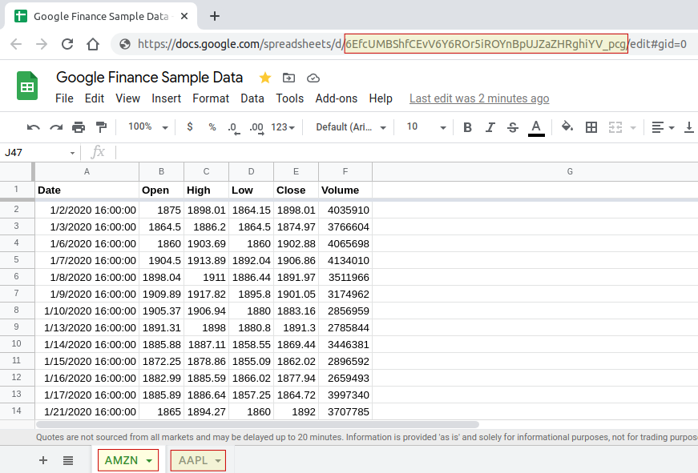

# Seaber : Demo account (using Google Sheets)

In order to build up an account with sample data with the intent of application demonstration for clients. This process allows reading initial data and settings from google sheets source and trigger a process to fill up the database.

## Google Sheet setup

A google sheet with a defined structure must exist and be shared by link to be readable by this app.



## Environment settings

`.env` is used to define PostgreSQL target connection, db schema and google sheet scope to be parsed.

These are the supported environment variables:

- PG_HOST=[postgres host]
- PG_DB=[postgres db name]
- PG_USER=[postgres db username]
- PG_PWD=[postgres db password]
- PG_PORT=[postgres db port]
- PG_SCHEMA=[postgres db schema for temp data] \# `gsheet_` *is added as a prefix to avoid app impact (drop happens before creation)*
- GOOGLE_SHEET_SRC=[source google sheet url with place holders - don't need to change]
- GOOGLE_SHEET_ID=[google sheet unique id] \# *highlighted in URL*
- GOOGLE_SHEET_TABS=[google sheet tabs and column range to be captured]

Copy `.env.example` to `.env` and change accordingly. 

## Building image

Run `docker-compose build --no-cache` to generate docker image.

## Executing

Trigger it with `docker-compose run py-demo-load` to run once, load data into postgres schema and stop the container.

## Local development (venv)

Use python virtual environment (venv) for local development. Check existing global installation with `virtualenv --version`.  If not installed, run the following `pip install virtualenv`.

### Enable and use venv

*Check pip location*

```sh
which pip
pip list | wc -l
pip list
python --version
```
*Apply venv to the project*

```sh
cd ~/path-to/my-project
python3 -m venv ./venv
source ./venv/bin/activate
```
*Check local python and packages installation*

```sh
which pip
pip list | wc -l
pip list
python --version
```

*Deactivate venv*

While in venv mode, type `deactivate` to exit from the virtual environment.

### Install project requirements

While *venv* is active, install individual packages with `pip install <package>` or from the listing as follows:

```sh
pip install -r requirements.txt
```
Check if all necessary packages are installed with `pip list`.

To generate a new requirement list, run `pip freeze > requirements.txt`.
